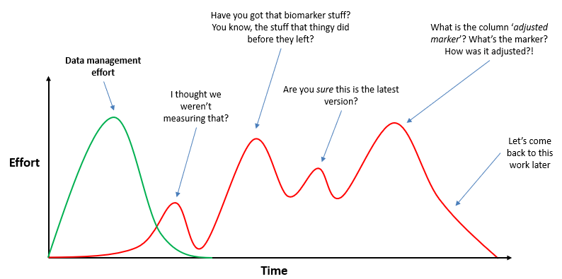

### Data Chaos

Today, many people organise the files associated with some sort of data project in the same manner as they've always done it. Namely, to save files in a sporadic fashion with generic filenames, often
differing from project to project. The result is **waste**. Wasted time, wasted money and wasted effort, plus the obvious risks of mistakes, with files being lost, shared with the wrong people, or incorrect 
files being used for subsequent analysis.

Have you ever experienced a conversation such as the following?

- *Hey, have you got that data file that so-and-so did a while back?*
- *Erm, that stuff to do with those blood-marker measurements?*
- *Yeah, that's the one*
- wait 20 minutes
- *Found it. It was in an email. I'll forward it to you*
- receive a file called **data_final_17.xls**

If you have, you're not alone, and it might not seem that big of a deal. But consider the problems that surround this example. 

First, the exact file can't be identified. It's unclear exactly which file is needed, what it relates to, who created it, when, how, and which project it's associated with. 

Next, its location is a mystery, with the file having to be searched for. Eventually, its location is found to be inside an email, which means its access is limited whilst at the same time its distribution is potentially open to anyone, for better or worse. 

Finally, the filename is completely ambiguous. How can you be so sure it's the correct file? Your only chance to is glean some information from the email that is was attached to, or to explore the content of the file itself. And what does the '17' refer 
to? The 17th version? The 17th year? Some sort of ID number?

This lesson will explain some key elements of **project organisation and data management**. These are **file-naming and folders**, the use of **meta-data** and the concept of **raw data**.

Without these core ideas, the most sophisticated data analysis in the world will rest upon shaky foundations, and at an extreme, could lead to the failure of the entire project.  

#### **Example 1** - 'Westpac jumps the gun on profit' (The Sydney Morning Herald)

*"Westpac was forced to halt trading on its shares and deliver its annual profit briefing a day early after it accidentally sent its results by email to research analysts"*

#### **Example 2** - 'Hypertension retracts paper over data glitch' (retractionwatch.com)

*"Hypertension, a journal published by the American Heart Association, has retracted a 2011 paper looking at the implications of blood pressure management guidelines after the authors discovered they had bungled the merging of their data files"*

#### **Example 3** - 'Data questions prompt retraction of PLOS ONE cardiovascular paper' (retractionwatch.com)

*"PLoS One has retracted a 2013 article on atherosclerosis in mice over concerns about the integrity of the data"*  

These are big, headline-making examples, but similar problems are almost certainly widespread.

However, the good news is that huge strides can be taken away from such potential errors by a handful of basic data management principles.

### Reproducible Research

This isn't just about preventing mistakes or taking a while to find a file. There is a larger issue here, all to do with the concept of **reproducible research**. This is the idea that when you're 
working on a project that involves data analysis, that analysis can be redone *precisely* at some future point, allowing all results to be checked and verified.

There is also an efficiency aspect, and simply not being constantly frustrated when working on a project. Below is an attempt to illustrate the point,
showing that data management, when done well, can save time and confusion.

> ## Exercise: Data problems
>
> Think about issues you've encountered over the years relating to data. What were they? Issues around finding data? Knowing what the data is when you do find it? Knowing what's been done to data 
and by whom? Etc.
>
>
{: .exercise}