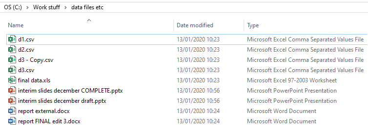

Poor file-naming can make your life and the lives of your collaborators unnecessarily stressful. Data will be lost or at best hard to find. Incorrect files will be used and shared. 
Important files will be overwritten. For the sake of a few extra seconds when saving your files, all of these issues can be remedied.

### The Principles of Good File-naming

- **What to include:** Common elements that a filename should include (where relevant) are: Version number, date of creation, name of creator, description of content, name of team/department, and project number
- **Longevity:** Naming policies should outlive the creator and be universal. Avoid generic names that might clash with other files, and consider scalability. For the version number, ensure it has enough digits for the future (e.g. v001 instead of v1)
- **Changes:** Always record changes to your data, even when small
- **Revisions:** A useful convention is to use ordinal numbers for major revisions and decimals for minor revisions (e.g. v001 to v002 for a major revision, and v001 to v001.1 for a minor revision)
- **Characters:** Don't use special characters (including #.<>$%!&*?”{}/:\@), use underscores instead of spaces, and format dates correctly
- **Consistency:** Be consistent between projects
- **Dates:** A good format for date designations is YYYYMMDD or YYMMDD. This format ensures that files stay in chronological order, even over the span of many years
- **Multiple files:** On occasion, data are autogenerated with base file names (e.g. f00001, f00002, ...). In this case, consider using a batch renaming tool
- **What not to use:** Avoid words such as 'final', 'revision', etc, as they aren’t specific

An example of a poor filename would be: **results final 7.xls**. An example of a good filename would be: **ELISA_ID123_RH_170719_v002.xls**.

Thinking about and typing a good filename may take an extra 30 seconds, but it may cost you a lot more time in the future if you don't.

One issue you may encounter when following the above guidelines is a large number of previous versions. For example, you may edit and resave a file everyday for several months. What should you
do with the old versions? One approach would be to create an 'archive' folder, and put older files in there. These could be compressed by storing them in an archive file in order to save space
(e.g. a zip or tar.gz file). If your older files are too large simply to store in an archive, even after compression, there are a few options. One would be to only save those files that contain
major revisions, deleting any that contained minor changes. Another would be to store the files on cloud storage, where tens of gigabytes of space can now be purchased very cheaply.

### The Principles of Good Folder Organisation

- **Most importantly:** Use folders! Do not create a desktop of doom, with 200 random files littering your screen
- **How many:** Use a sensible number of folders. Too few may mean too many files in a single folder. Too many may mean they're difficult to navigate
- **Names:** Use sensible names. Don't worry about the level of detail for files, but do consider project names and the types of files in each folder, such as 'raw data', 'reports', 'code', etc
- **Consistency:** Be consistent between projects
- **Structure:** Structure hierarchically. Start broad and drill-down into specific areas or projects
- **Reviews:** Review folder content periodically, and consider moving older files that are no longer needed into an 'archive' folder

> ## Exercise: Folder example
>
> How could you improve the following set-up?
> 
>
>
> > ## Solution
> >
> >
> > ~~~
> > * Rename the folders
> > * Rename the files (name, dates, remove words like 'final' and 'complete')
> > * Create new folders, including an archive
> > ~~~
> {: .solution}
{: .exercise}

