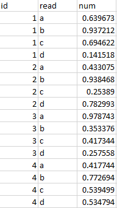
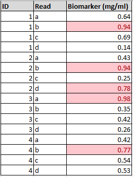

### The concept of raw data

The term 'raw data' is common and often heard in many different contents. However, when there is no agreed definition of what this actually means, problems can arise.

Raw data means unedited and unprocessed. It is the file that the instrument exports, or the file that you download from a cloud-based sensor, or the base file that you've created by manually entering 
some figures. It is in a very simple format, such as .CSV or .TXT, and may well be messy and require considerable processing before it becomes useful.

Other names for raw data are source data or primary data.

### The importance of raw data

One key aspect to modern data analysis is the idea of reproducibility. In other words, being able to understand what has been done to data, and to possibly recreate the workflow. The only way to ensure this
is to start with the raw data and turn it into the final output (whether this is a table, a plot, or simply a clearer dataset for some other, future use) via a series of steps.

First, if you begin this process with data that has already been edited, processed and cleaned in a number of unknown ways, you may never be able to fully reproduce the workflow. Second, the processing
may mean that the data is then harder to work with in certain situations (for example, converting a CSV file into an XLS file, containing formatting, makes it more difficult to deal with in code-based
analysis environments such as R or Python).

Raw data,

Not raw data,

