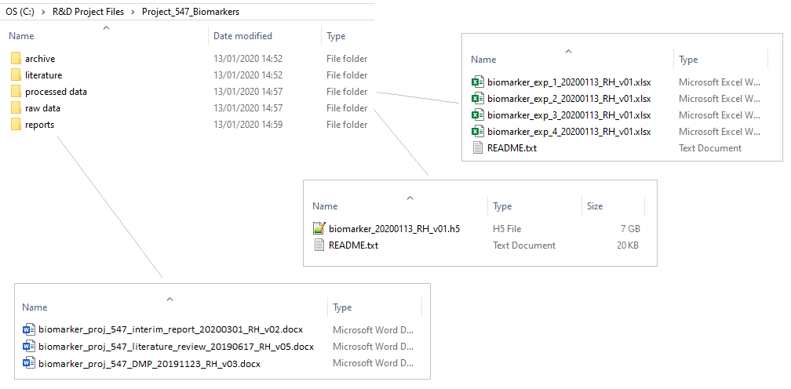

### Data Management Planning

Often with projects that generate data, the datasets produced are relatively small and straight-forwards. For example, a single experiment with a single datafile which contains ELISA plate data is very easy to handle. However, what if you've planned a project that is expected to generate **10,000 small files**? Or **10 huge files**? What if the data is known to be in an uncommon file-format (from, say, an old piece of equipment), or what if you're expecting outside help to process the data? In cases such as these, planning the data aspects of an upcoming project can be beneficial.

Data management plans are typically short documents that outline the plans for the use of the data throughout the project's life-cycle. Also note that data management plans are becoming a requirement for many funding organisations. This document should briefly answer the following questions,

- What data will you collect or create? 
- How will the data be collected or created? 
- What documentation and metadata will accompany the data? 
- What statistical methods and tests will you employ? Do you need to calculate samples sizes a-priori?
- How will you manage any ethical issues? 
- How will you manage copyright and intellectual property rights issues? 
- How will the data be stored and backed up during research? 
- How will you manage access and security? 
- Which data should be retained, shared, and/or preserved? 
- What is the long-term preservation plan for the dataset? 
- How will you share the data? 
- Are any restrictions on data sharing required? 
- Who will be responsible for data management? 
- What resources will you require to implement your plan? 

The [Data Management Planning Tool](https://dmptool.org/) is a free, online platform that allows data management plans to be created quickly from a range of templates.

Data management plans should be reviewed as a project progressed, and modified accordingly.

As part of a data management plan, it may be useful to create a flow-diagram of the planned data-flow through the expected **analysis pipeline**, i.e. a visual overview starting with the raw data, through all analysis steps (and associate files used), to the final output.

### Example of a good project setup

Now that we've covered all the main topics for setting up the files and folders of a project, let's take a look at an example of a good project setup,

> ## Exercise: Data problems and solutions
>
> Think of a past project where you encountered some sort of data issue. Which of these ideas (file-naming, folder organisation, meta-data, data dictionaries, data management plans) would be useful and why?
>
>
{: .challenge}