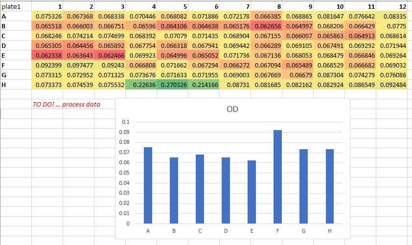
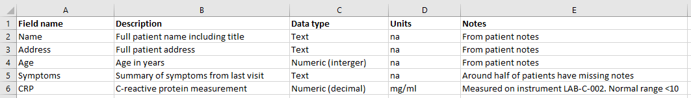
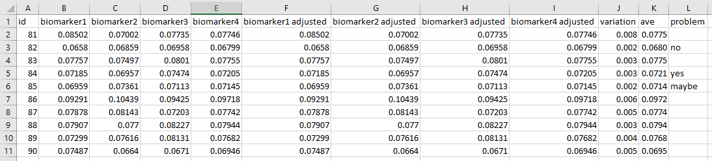
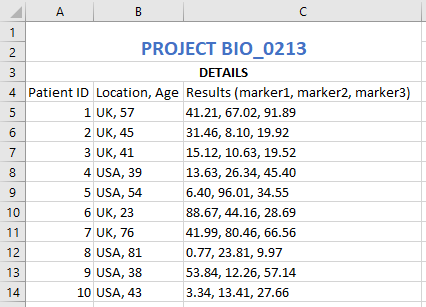
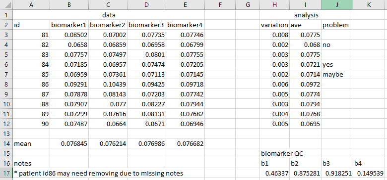
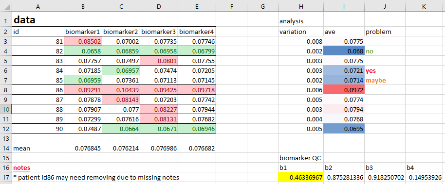
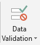

In this section we'll look at how to use spreadsheets in an efficient, clear and reproducible way. 

Note that the focus of this section is on those situations where data analysis is confined to a spreadsheet. It is *not* guidance on how to prepare data for code-based analysis.

Using spreadsheets in accordance with established best-practice may at times seem burdensome and quite different. But it doesn’t have to be an overnight switch. The key aim is to ensure that 
either a human or a computer can understand the data at a later date. Spreadsheets are rarely a one-time creation, and avoiding clutter, noise and ambiguity is key to future use.

### Raw means raw

**Raw data** is that which is untouched. It is the file that comes from the instrument, or the file that is created once the initial figures have been
entered. It does not contain formatting, italics, bold titles, calculations or plots. This is the point at which you start, and to which you should always
be able to return. Make backups, protect it at all costs, and as soon as you start to work on it, *save your consequent work as a new 'analysis' file*.

If you ever ask someone for their raw data and receive a file that looks like the following, you now know better!

### Create a data dictionary

**Meta-data**, or 'data about data', is an essential piece of any project that wishes to be reproducible. Spreadsheet files should be handled within 
projects using basic project organisation principles, such as having a **README.txt** file explaining details of the file. 

One way of improving the **reproducibility of a spreadsheet file is to have a tab or separate spreadsheet file that contains variable names and associated details. For example,
it may list all variable names, their units, maximum and minimum values, internet references to find out more, etc.

An example data dictionary,

### Consistency and sensible names

**Consistency** within and between files is essential for the long-term, efficient use of data, where the chances of introducing errors is minimised.
For example, if you were to use **'sample 1'** in one file, **'s1'** in second and **'1'** in a third, it's going to take you and others time to figure things
out later on. 

Similarly, if you chose to use a **blank cell** to represent missing values one day, but **'missing'**, **'unmeasured'**, and **'na'** on others,
you're introducing unnecessary ambiguity.

Having sensible names is also important. **'Sample 1'** is a meaningful header, but **'s1'** isn't. Think also about the ideas of meta-data. Including 
certain pieces of information like variable units could reside in a data dictionary, but for small pieces of work, having such information in the 
column headers is fine. For example, **'CRP (mg/ml)'** is more useful than just **'CRP'**. In this example, even better for later use in certain programs
would be **'CRP_mg.ml'**, avoiding characters like brackets and slashes.

Never underestimate the importance of everyone being on the same page with units. In 1999, NASA and Lockheed Martin used different units on the same 
aspect of a particular project, leading to the [destruction of the $125 million Mars Climate Orbiter](https://en.wikipedia.org/wiki/Mars_Climate_Orbiter).

Below is an example of some poor variable/column names,

### Dates

Spreadsheet programs love to guess what you're doing, and at the top of their guess-list are **dates**.

In the paper *Gene name errors are widespread in the scientific literature* by Ziemann M, et al, they state that *"The spreadsheet software Microsoft Excel, when used with default settings, is known to convert gene names to dates and floating-point numbers. A programmatic scan of leading genomics journals reveals that approximately one-fifth of papers with supplementary Excel gene lists contain erroneous gene name conversions."*. 
They go on to state that *"gene symbols such as SEPT2 (Septin 2) and MARCH1 [Membrane-Associated Ring Finger (C3HC4) 1, E3 Ubiquitin Protein Ligase] are converted by default to ‘2-Sep’ and ‘1-Mar’, respectively"*.

To avoid this and similar issues, it's a good idea to set the format of the relevant column to **'text'** instead of **'general'** first. It's essential
that this is done *before* data are entered, otherwise programs such as Excel will convert what it thinks are dates into a numeric representation.

If you do mean to use dates, again, consistency and meta-data are the key. For example, does a cell in a column called 'Date' that reads **'2020-10-01'** 
mean the 1st of October or the 10th of January? This ambiguity could be easily removed if the header was **'Date_yyyymmdd'**. 

There are also ways to prevent Excel from converting dates into a date format. For example, entering a date as, say, 20201005, will keep the data as a number.

### Empty cells

What does a **blank cell** indicate? Is it genuinely missing data? Or, has some piece of data not been entered yet? Worse still, could it be mistake?
Perhaps someone hit the delete key by accident? In general, a blank cell is not only ambiguous, but it can also hinder ordering and searching functions.

For example, if you were to leave several blank cells to mean 'the same as above', ordering by that column will not work.

In general, pick a way of indicating missing data, such as **'na'**, and stick to it. Also, *never* use a zero to represent missing data! Any consequent analysis may inadvertently use it
as a real value.

### One cell, one datum

Analysing data when cells contain **multiple pieces of information** is a headache that no-one needs. 

For example, imagine you had a spreadsheet with a column detailing a patient name and postcode, e.g. 'J. Kirby, YO22', 'J. Batey, YO10', and 'S. Masca, LS14'. If you wanted to process this
information in anyway, from counting the number of different postcodes, picking out the most common surname or simply ordering by postcode, you'd first
have to split the column. It's far easier to use two different columns from the start.

**Merging cells** is a similar issue. Merging multiple cells into a single cell may look good, but it does nothing for subsequent processing. For example,
as soon as you save your file as a CSV, the merging is lost and you end up with an empty cell.

Below is an example of a poor use of columns,

### Rectangular data

Spreadsheets work best from an analysis point-of-view when data is **rectangular**, where each row is some sort of observation and each column is a variable. This
is not only easy to understand by eye, it's also easy for other programs to load (and extremely useful for any subsequent code-based analysis).

If your data contains multiple parts, each of which is or can be structured in the form of a rectangle, consider putting each into its own tab, or even into a separate file. 
The latter may seem overly complicated, and may not always be necessary, but recall that CSV files cannot save multiple tabs. Also, consider keeping plots in their own tab.

Below is an example of non-rectangular data,

An exception to the above may be if you are using a tab in a spreadsheet for **interactive analysis**, changing values and wanting to see the realtime chnages to summarys statisitics and plots. In
that case, the other ideas in this section are extremely important, to prevant the tab from becoming busy and confusing. Notes can be useful, but keep them at a minimum. Any substantial
documentation is best kept in a README.txt file or similar.

That said, if you're analysing your data in an interactive fashion, perhaps changing the contents of cells repeatedly and tinkering with values, you may be on a slipperly slope of 
**non-reproducible research**. Be careful! **Macros** can very be useful here, with calculations done automatically, reducing the amount of manual intervention.

### Avoid colour

Adding colour to spreadsheets is extremely common, and the reason is obvious; it generally enhances the visual usability of the data. Where before you
may have had a dull collection of numbers, you now have high numbers in red, low in green, healthy patients in purple, diseased patients in yellow, etc.

The problem with this is that colour is completely useless when it comes to analysis. You cannot search by colour, and sorting by colour doesn't convey
as much information as a clear label. Nor can you export the colour details via CSV to some other program.

It's far more useful to **create new columns** that contain the details of whatever information you are conveying with colour. For example, rather than
using colours to highlight 'high' and 'low' values of some numeric column, instead create a column called, say, 'Category' or 'Range', with the values
of 'high', 'low' and 'normal' in the cells. Do this using something such as **'=IF(CELL>0.2, "Yes", "No")'**, where the cell reference is the value of interest that you are
currently highlighting with colour.

You may be very attached to using colour in your files. If you are, at least add a new column as well!

Below is an example of poor colour-use,

### Validation techniques

Excel possesses a simple but effective **data validation** function, that places rules on the data that gets entered. This can take a few minutes to setup,
but if you're manually entering data, that time could save you from costly mistakes.

> ## Exercise: Validation
>
> Modern spreadsheet programs often have data validation tools. For example, in Excel, select a column, then click the 'data validation' option from the 'data' tab. Click 'Allow' and select 
'Whole number'. For 'Minimum' and 'Maximum', enter 0 and 10, respectively. Click OK. Now, try to enter anything that isn't a whole number between those ranges.
> 
>
>
{: .exercise}

### How to save

Files such as those in an Excel format *can* be opened in other pieces of software, but in reality, they really want to be opened in Excel. If, for example, you do 
manage to load an Excel spreadsheet into a coding environment such as R or Python, any formatting, plots or equations are going to cause havoc. Even
loading an Excel spreadsheet into an Excel-like program, such as LibreOffice, can lead to problems with how certain elements are displayed.

If you are going to perform analysis within your spreadsheet files, save in program's default format, such as XLSX for Excel (remembering to adhere to file-naming best practice).

If the intention is then to **share your analysis** at this point, be aware of data safety and privacy issues. If you've been asked for a table or plot, perhaps just share
the table or plot as an image? Sharing the raw data plus several tabs of analysis just to get to that table or plot should be avoided.

If your file is a *data* file, i.e. it does not contain formatting, formulae and plots, the best format is a CSV. This is non-proprietary and can be
opened easily with a range of different programs. 

In some situations you may start with raw data and process it via a spreadsheet software into some improved, more useable form. In this case, save the file that performed
these changes as an Excel file (for example), *but save the consequent, improved data file as a CSV*. This can then be used for clear, straight-forward analysis later,
whilst the details of the changes are retained.

> ## Exercise - Spreadsheet example
> 
> Load the file 'manual-data-example-01.xlsx'. Pick out as many aspects of this file that may hinder reproducibility. How would you change them? There is no single right answer to this. The aim is to improve the file, not necessarily make it perfect.
>
> Note: It's always useful when looking at a new spreadsheet for the first time to ask the question; **What is the aim of this file?** Is it ultimately to produce a plot? A neater, more useable 
> version of the data? To explore the data? In this case, assume the point of this file is to find the **out-of-range samples**
>
> 
> > ## Solution
> > 
> >
> > ~~~
> > 1. Deleted the 'raw' tab as it should be in its own file, saved as a CSV. Also, the 'max' row should be removed to make it 'raw'
> > 2. I would create a README.txt file, explaining what the Excel file, raw data file and analysed data file are. Could then include the info from the 'misc' tab
> > 3. Deleted the 'data', 'stuff' and 'misc' tabs
> > 4. Created tabs for plate 1 and plate 2
> > 5. Created tabs for plate 1 and plate 2 analysis
> > 6. Created a data dictionary
> > 7. Delete the 'PLATE 1' and 'PLATE 2' rows at the top of each tab
> > 8. Created a 'Standards' tab
> > 9. Created a 'Standards plot' tab and tidied up the plot
> > 10. Deleted the '405' column next to the plate data
> > 11. Removed the merged title cells ('Absorbance, 405 nm (uncorrected)'). Less info, but covered in the data dictionary
> > 12. Removed the conditional formatting for the 'CV' column and create a new one called 'High value', with 'yes' and 'no' accordingly. Used =IF(CELL>0.072, "Yes", "No")
> > 13. Used the same header info ('rep1' etc rather than 'a' etc)
> > 14. Corrected 'd' to 'Mean' (look at the formula)
> > 15. Set both sets to 5 decimal places
> > 16. Added 'note' column. Added a useful note and removed colour
> > 17. Added 'na' to blank columns in plate 1 data
> > 18. Added a 'plate definition' tab
> > 19. Unified font and removed horizontal lines
> > 20. Copied the data into a new 'Results' tab, values only (no references), created a new 'plate' column, unified formatting. Sample column changed to numbers only. Ordered by plate value then sample number
> > 
> > Note: Could arguably keep the heatmap. It's fine as it's not aiming to classify the data, it's purely a visual tool. That said, does it help the aim
> > of finding out-of-range values? Not when that's defined as a CV above a certain value. If the heatmap is to spot, say, some other out-of-range value
> > that may indicate an experimental issue, is a visual aid a good method for reproducibility? Does that lead down the road of the subjective "Hmmm, that
> > looks a bit high". Better with a new column
> >
> > Note: This cleaned 'Results' tab data could be saved as a CSV file for consequent work. If so, ensure the file is described accordingly in the README.txt file
> > ~~~
> {: .solution}
{: .exercise}
  
Remember, the aim isn't to make a spreadsheet look better. You might even conclude that it looks worse! The real question is 
*"when I come back to this in 18 months time, when someone has asked me why and how I did what I did, will I understand it?"*. Or, *"if someone else looks at this, will they understand it?"*. 
Or, perhaps, *"If I do a similar experiment next month, how do I ensure I'm handling the data in the same way?"*, i.e. minimising subjective decisions or errors.

For further reading, take a look at the article [Broman, Karl W., and Kara H. Woo. "Data organization in spreadsheets." The American Statistician 72.1 (2018): 2-10.](https://www.tandfonline.com/doi/full/10.1080/00031305.2017.1375989)