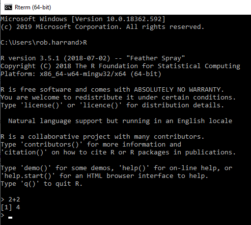

---
# Please do not edit this file directly; it is auto generated.
# Instead, please edit 10-r-and-rstudio.md in _episodes_rmd/
title: "R introduction: R and RStudio"
teaching: 15
exercises: 5
questions:
- "How do we use R?"
objectives:
- "Understand what R and RStudio are"
keypoints:
- "RStudio is the software used for coding in R"
---

### R

R is a programming language designed specifically for statistics and data analysis. It's used worldwide in all industries, including science, finance,
healthcare and government, by companies such as Facebook, Twitter, Microsoft and Google. Below is an image of what it looks like,

As you can see, it doesn't look particularly easy to use. After all the text information at the top that loads each time, you can see the actual
command prompt (where code is entered) at the bottom. Here, '2+2' has been entered, giving the result of 4.

### RStudio

To allow R to be used for real-world data projects, a program called RStudio is used, which effectively sits on top of R. This allows the R functionality to be used, but in a modern programming environment. RStudio allows you to not only write lines of code, but to create projects (where all relevant files and data are bundled together), notebooks (documents with text and code integrated together), presentation slides, websites and interactive apps.

Below us an image of what it looks like,

The 4 main areas (which may be positioned differently on your screen) are,

1. **The source**. This is the part where you enter your code
2. **The console**. This is R working under-the-hood. When you run your script in the window above, it will be executed here
3. **Environment**. This is where any variables that are being used can be seen. More on these later
4. **Everything else**. Here you can see details of files, packages, help information, and any plots that have been created

To run code, you can either click on a line and press CTRL-ENTER, or click the 'Run' button the top-right corner of the source panel.

> ## Exercise: Your first R command
>
> Load RStudio and in the source section, type and then run the following code. What happens?
>
>
> ~~~
> (10+10)*2
> ~~~
> {: .language-r}
>
> > ## Solution
> >
> >
> > ~~~
> > [1] 40
> > ~~~
> > {: .output}
> {: .solution}
{: .exercise}
