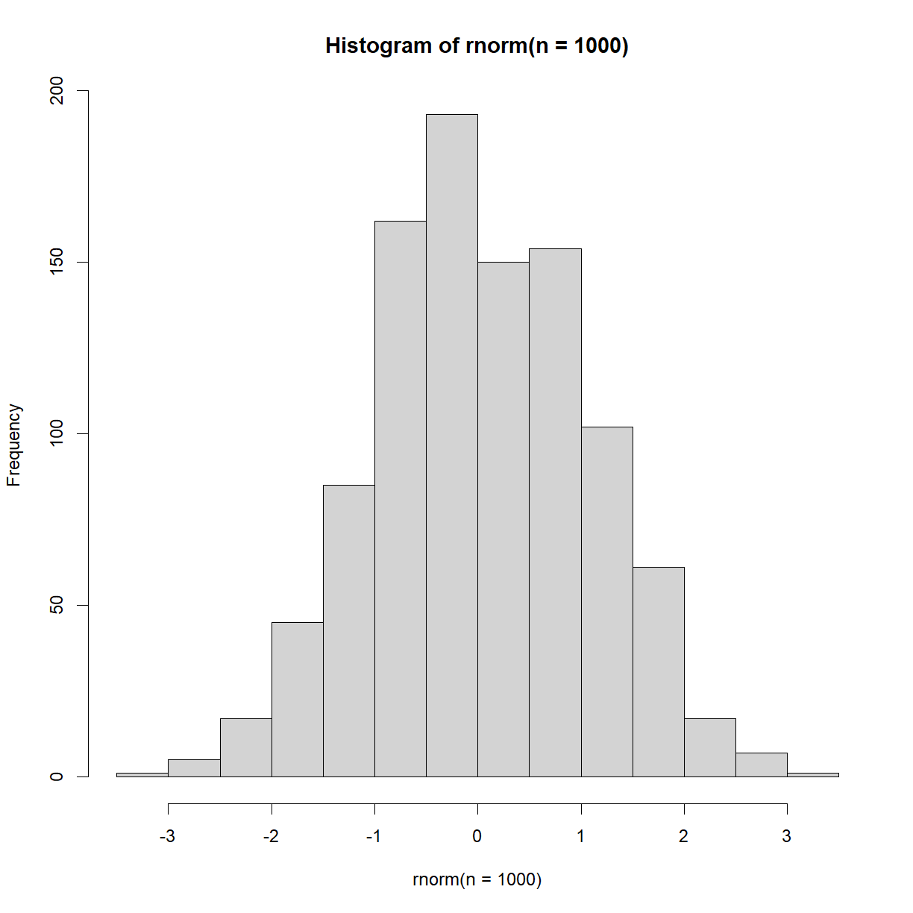
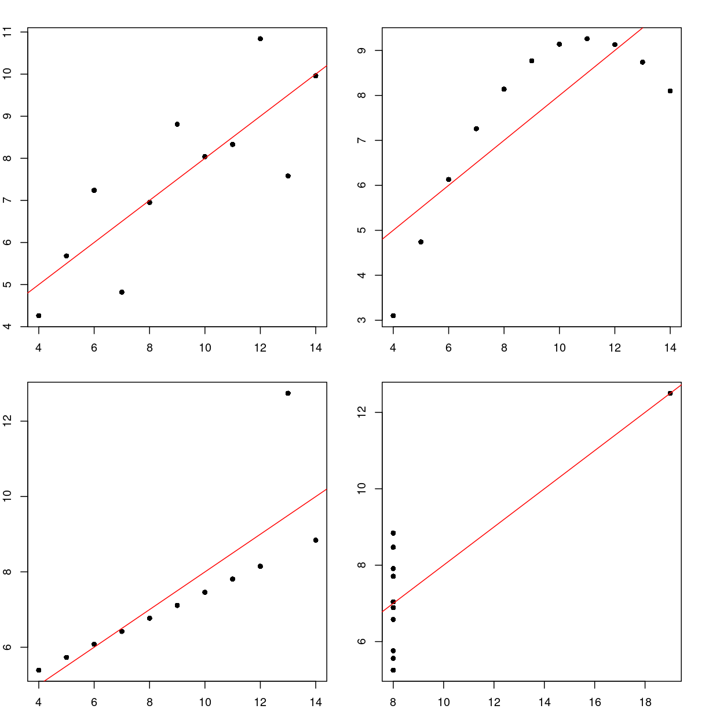
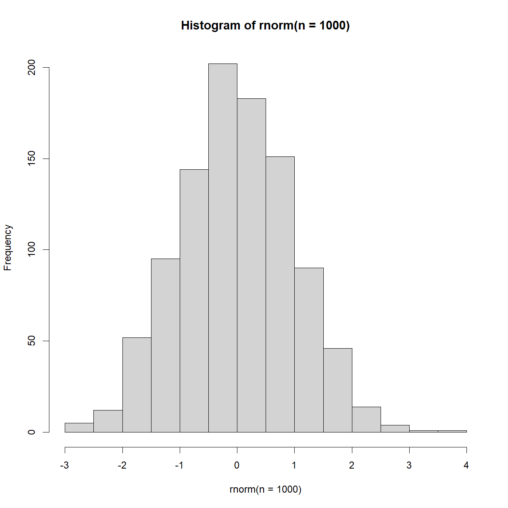
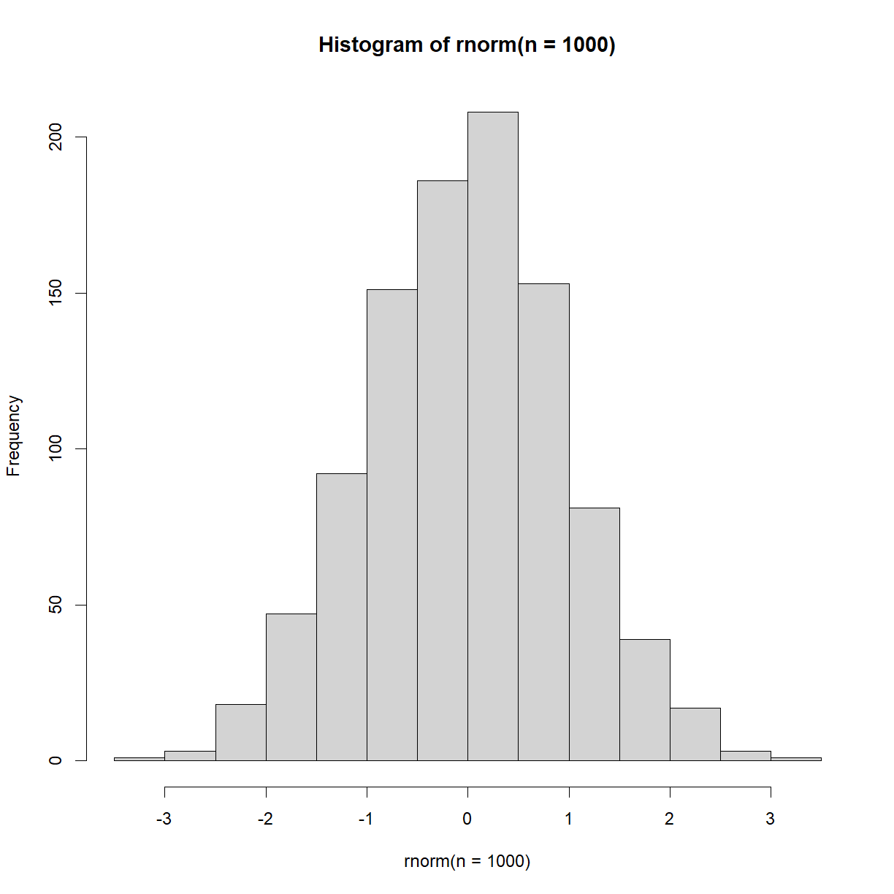
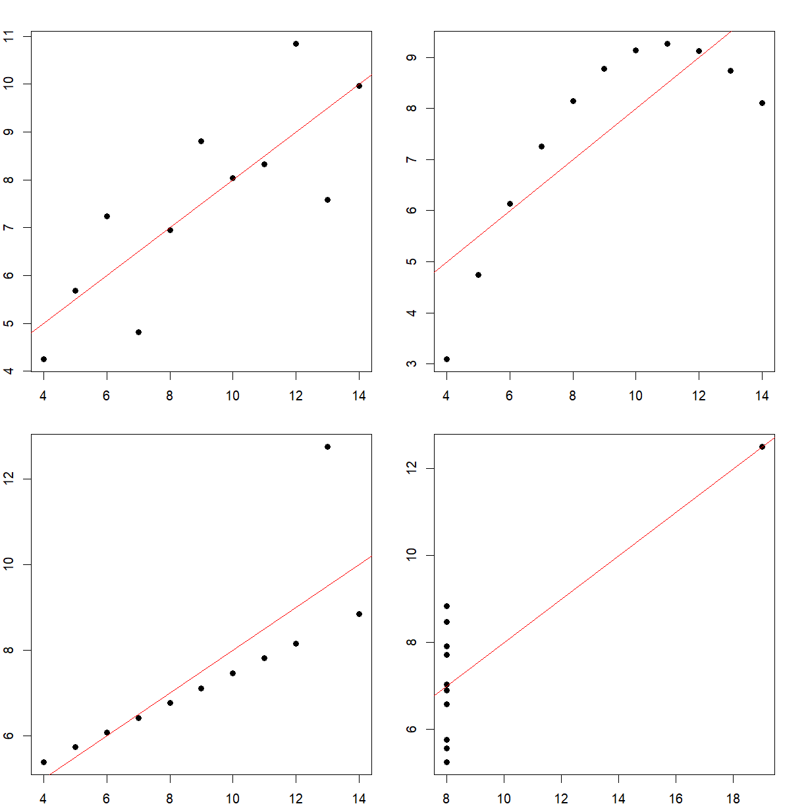

---
# Please do not edit this file directly; it is auto generated.
# Instead, please edit 12-r-data-manipulation-and-plotting.md in _episodes_rmd/
title: "R introduction: Data Manipulation and Plotting"
teaching: 50
exercises: 45
questions:
- "How do we get going with real data?"
objectives:
- "Start to deal with real data and replicate some of the tasks done in spreadsheets"
keypoints:
- "Analysis code is built line-by-line"
---

### Loading Data

R can handle a wide variety of data-types. For this lesson we'll keep things simple and load a CSV file. First, set your **working directory** (the path to the files for this workshop on your PC) with the following, adding the path in between the brackets and single quotation marks. Note, you must use forward brackets for the path /

~~~
setwd('') #Set working directory
~~~
{: .language-r}

Next, type the following,

~~~
df = read.csv('../data/data_carpentry_test_data.csv')
~~~
{: .language-r}

You should see 'df' appear in your 'Environment' tab, showing 8 observations and 13 variables (rows and columns). This is a data-frame. Click it for a preview.

We can also investigate the dataframe using code,

> ## Exercise: Subsetting dataframes
>
> Type the following, one line at a time, and see what happens
>
>
> ~~~
> head(df)
> tail(df)
> df[1,]
> df[,1]
> ~~~
> {: .language-r}
>
> > ## Solution
> >
> >
> > ~~~
> > head(df): The first 6 rows are displayed
> > tail(df): The bottom 6 rows are displayed
> > df[1,]: The first row is displayed
> > df[,1]: The first column is displayed
> > ~~~
> > {: .output}
> {: .solution}
{: .exercise}

With this last command you may notice that underneath the output, it says 'Levels'. If you expand the 'df' object in your environment panel (by clicking the down-arrow next to it), you'll see that the column X1 is a **'factor'**. Factors are another important data type in R, and they're used to represent categorical data. These categories can be unordered, such as 'Male and 'Female', or ordered, such as 'High', 'Medium' and 'Low'. As you can see, the categories (or level) here are A, B, C, D, E, F, G and H.

A code based way of checking the data types within a data-frame is to use the **'str()'** command. Try it out.

### Data-frames

Data-frames are the work-horses of a lot of data analysis in R. As you saw above, they can be subsetted to pick out certain rows or columns. This allows parts of a data-frame to be extracted, processed and analysed without effecting the original data.

> ## Exercise: Creating new subsets
>
> Type the following code. What have you just created?
>
>
> ~~~
> df_2 = df[,c(1:3)]
> ~~~
> {: .language-r}
>
> > ## Solution
> >
> >
> > ~~~
> > A new dataframe, made up of the first 3 columns of the original dataframe
> > ~~~
> > {: .output}
> {: .solution}
{: .exercise}

There are lots of useful tools in R for working with data-frames,

> ## Exercise: Dataframe functions
>
> Investigate the following functions, **dim()**, **colnames()**, **summary()**
>
>
> {: .language-r}
>
> > ## Solution
> >
> >
> > ~~~
> > dim(): Returns the dimensions of the dataframe, colnames(): Returns the column names of the dataframe, summary(): Returns a summary of the dataframe
> > ~~~
> > {: .output}
> {: .solution}
{: .exercise}

Note, when an R function gives you multiple values, you can just get individual values by indexing with square brackets. For example,

~~~
dim(df)[2]
~~~
{: .language-r}

~~~
[1] 13
~~~
{: .output}

What have we just returned?

The colnames function can not only be used to see what the existing column names are, but also change them. For example, we could write the following,

~~~
colnames(df) = c('Col_1', 'Col_2', 'Col_3', 'Col_4', 'Col_5', 'Col_6', 'Col_7', 'Col_8', 'Col_9', 'Col_10', 'Col_11', 'Col_12', 'Col_13')
~~~
{: .language-r}

However, that's time-consuming. There is a much better way by using an extremely useful function called **paste()**. Paste allows text and variables to be combined. For example,

~~~
num = 5
paste('The number is', num)
~~~
{: .language-r}

~~~
[1] "The number is 5"
~~~
{: .output}

With this in mind, we can now use 'paste()' and 'seq()' together to make the renaming of columns much easier,

~~~
df = read.csv('../data/data_carpentry_test_data.csv') #Reload to reset the column names
colnames(df) = paste0('Col_', seq(1:13))
~~~
{: .language-r}

This is much better, but there is still an issue. The number of columns, 13, is hard-coded. In other words, I have had to look to see how many columns there are and then type it. If you were running this code on many files and the dimensions changed, this would break.

> ## Exercise: Dataframe functions
>
> How could we make the code above more robust? What could we replace the number '13' with? We've already seen the code somewhere else above.
>
>
> {: .language-r}
>
> > ## Solution
> >
> >
> > ~~~
> > colnames(df) = paste0('Col_', seq(1:dim(df)[2]))
> > ~~~
> > {: .output}
> {: .solution}
{: .exercise}

Data-frames can be combined and merged in a number of ways, arguably the most useful functions being **merge()**, **rbind()** and **cbind()**.

First, let's create two example data-frames to test the functions,

~~~
df_1 = df[c(1:4),]
df_2 = df[c(5:8),]
~~~
{: .language-r}

Take a look at them. Now, let's try **rbind()**,

~~~
df_rbind = rbind(df_1, df_2)
~~~
{: .language-r}

This stacks the data-frames back by row. cbind() does the same by column. Not that these functions need the two data-frames to have the same number
of rows or columns, respectively.

Next, here is how you use **merge()**,

~~~
df_merged = merge(df_1, df_1, by = 'Col_1')
~~~
{: .language-r}

What just happened? We've merged according to the values in 'Col_1', so the data-frames have been merged where these values match. In this case, it's 
the same data-frame twice, but you can see how you could combine two different data-frames where-ever they have a **common column**. This is how data
is structured in many **databases**, where different tables relate to one-another with a common column or **key**.

Finally on data-frames, save your data with **write.csv()**,

~~~
write.csv(df_merged, 'my_new_file.csv')
~~~
{: .language-r}

### Base Plots

Now that you can load data and subset data-frames, we can start to plot different parts of the data. For example, try the following,

~~~
plot(df$Col_2)
~~~
{: .language-r}

We've used a couple of new things here. First, we've used the **plot()** function, and second, we've picked out a column from the data-frame with the **$** symbol. This is a shortcut in R, and the auto-fill should help you whenever you type the name of a data-frame, followed by this symbol.

You should now have a basic plot of the values in column 2. As R is infinitely customisable, we can of course improve this plot. For example,

~~~
plot(df$Col_2,
     ylab = 'Optical Density',
     main = 'Plot of Index vs Optical Density',
     type = 'l',
     col = 'red')
~~~
{: .language-r}

This may look like a lot of effort for one plot, but remember that this is now completely transparent, reproducible, and the code could be reused over and over. For more details on the plot function, have a look at the help files.

Base R can create various other plots. For example, try out this box-and-whisker plot,

~~~
df$Sample = 'Sample 1'
df$Sample[c(5:8)] = 'Sample 2'

boxplot(df$Col_2 ~ df$Sample)
~~~
{: .language-r}

Don't worry too much about the first two lines. What they're doing is creating a new (made-up) column called 'Sample' and setting every value to be 'Sample 1'. It then sets the 5th through to the 8th values to be equal to 'Sample 2'. The boxplot is then plotting the numerical values in column 2 split by this new variable. This is of course easier when your data already has such categories.

How about a histogram?

~~~
hist(df$Col_2)
~~~
{: .language-r}

This plot isn't particularly interesting with this particular dataset. Recall earlier when we saw the **rnorm()** function? Let's now plot that data to see what we get,

~~~
hist(rnorm(n = 1000))
~~~
{: .language-r}

As expected, we see a normal distribution, centered on 0.

Notice on the plot panel you have an Export option. This allows you to save your image either to a file, or to the clip-board.

Something to keep in mind with plots in R is that they tend to be made for 2 different reasons. One is to create slick, professional plots for reports, presentations and publications. These take time to craft and are typically done using libraries beyond base R (the main one of which we'll see later).

The second reason for plotting in R is to **explore** the data. These plots are usually done in base R and produced quickly, in order to get a feel for the data. This idea of exploring data visually is an important concept, because it's very difficult to understand your data from glancing at the raw numbers or even summary statistics.

As a concrete example, consider the following 4 separate datasets,

~~~
anscombe = anscombe

#mean(anscombe$x1)
#mean(anscombe$x2)
#mean(anscombe$x3)
#mean(anscombe$x4)

#sd(anscombe$x1)
#sd(anscombe$x2)
#sd(anscombe$x3)
#sd(anscombe$x4)
~~~
{: .language-r}

All 4 have the exact same mean and standard deviation. It may seem like they're similar, if not identical. However, when we plot them,

~~~
par(mfrow=c(2,2)) #Setting up the 2x2 grid of images
par(mar=c(2,2,2,2)) #Setting up the plot margins
plot(anscombe$x1, anscombe$y1, pch = 16)
abline(lm(anscombe$y1 ~ anscombe$x1), col = 'red')
plot(anscombe$x2, anscombe$y2, pch = 16)
abline(lm(anscombe$y2 ~ anscombe$x2), col = 'red')
plot(anscombe$x3, anscombe$y3, pch = 16)
abline(lm(anscombe$y3 ~ anscombe$x3), col = 'red')
plot(anscombe$x4, anscombe$y4, pch = 16)
abline(lm(anscombe$y4 ~ anscombe$x4), col = 'red')
~~~
{: .language-r}

We see that they're very different. This is a famous example called [Anscombe's quartet](https://en.wikipedia.org/wiki/Anscombe%27s_quartet), and highlights the perils of trying to use summary statistics to understand your data.

One more point to raise. You may have noticed that we magically created this Anscombe's quartet data from no-where. R actually comes with many datasets pre-installed, to be used for learning how to code. To see the fill list, type,

~~~
data()
~~~
{: .language-r}

> ## Exercise: Built-in datasets
>
> Load the pre-installed dataset 'ChickWeight' or 'ToothGrowth' and explore it via any of the functions we've covered so far.
>
>
{: .exercise}

