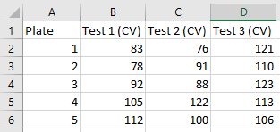
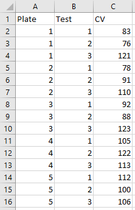

When analysing data using code, the ideal scenario is to go from the raw data to the finished outcome, whether that's a plot, a table, an interactive
app or machine-learning model, completely via code. Depending on the complexity of the data and the analysis, this may be made up of a series of different coding
scripts, creating a data analysis 'pipeline'.

Very often, the data that you start with is not optimsed for analysis via code. In fact, often the bulk of a data analysis project is data cleaning, 
with the actual analysis part only occurring at the end.

The optimal format for such analysis is known as 'tidy data', and looks quite different to the sorts of formats you may typically come across when
using spreadsheets. 

Often, you will deal with 'wide' data. That is, data with lots of columns and fewer numbers of rows. Specifically, each variable has its own column.
In R, the preferred format is 'long', where one column contains all of the values with the remaining columns giving those columns context. Below is
an example of data in a wide format,

Here is the same data restructured in a long format,

This format, where each row corresponds to a single data point or observation, is also know as 'tidy data', and is the preferred format in R. The goal
at the start of any data analysis should be to get your data into this format when possible.

The context for this course is 4PL plate data, which may at first not appear to fit this mold. After-all, the data is simply a 2D representation of
the ELISA plate. It doesn't look 'untidy' as that word is commonly used, but what you've actually got is a grid of measurements, often containing multiple
measurements for a given sample. Once you add these definitions to each plate file, the 'tidy' version becomes apparent.

There are also points during analysis where you'll have intermediate datasets, where again, tidy datasets will be beneficial.

### Exercise - Tidy Data examples

1) Take a look at the file 'untidy-to-tidy-eg1.xlm'. Have a look at the 3 tabs and see the different ways that the same data is laid out.
2) Take a look at the file 'untidy-to-tidy-eg2.xlm'. Again, see how the untidy data is transforms to the tidy format
