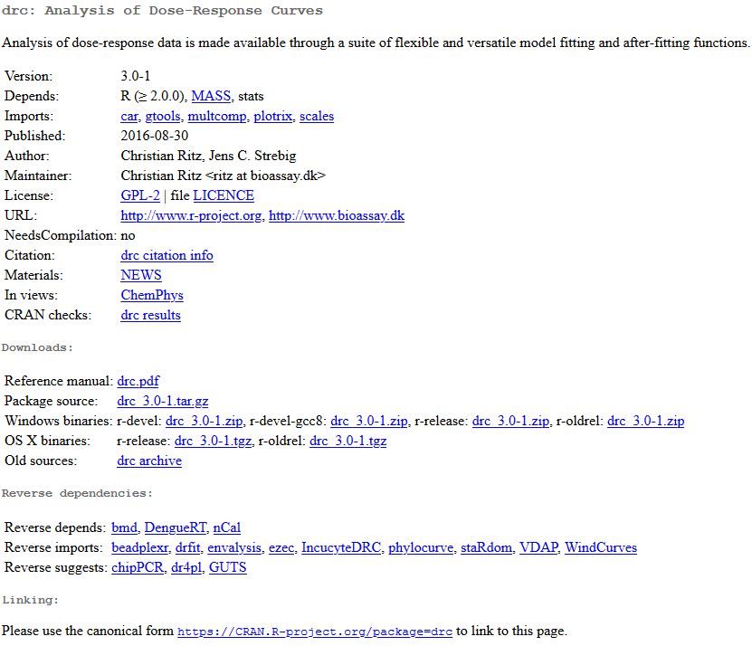

### Loading packages

We've seen how R comes with a variety of built-in functions, and we've used many of them to perform various tasks. R can also be extended using any of thousands of additional libraries, each of which comes with several new functions. For a list of all of these libraries (also known as packages), see the Comprehensive R Archive Network (CRAN) website [here](https://cran.r-project.org/web/packages/available_packages_by_name.html).

This list can be overwhelming. Go to 'find' on your browser and type in 'drc'. Go through the matched items until you see the package called 'drc'. Click on it and you'll see that it's described as *"Analysis of dose-response data is made available through a suite of flexible and versatile model fitting and after-fitting functions."*



There is a lot of information here. The part that's possibly of the most use is the reference manual in the form of a PDF. Every package in R comes with a reference manual like this, and outlines all of the additional functions and how to use them. We'll return to this package later.


### ggplot2

The first package we'll use is called **ggplot2**, where 'gg' stands for 'grammar of graphics'. This is the main plotting tool used in R for producing professional plots.

First, you'll need to install the package with the following code,

```{r}
install.packages('ggplot2')
```

And then load it with,

```{r}
library('ggplot2')
```

Let's take a look at how to use this new package,

```{r}
elisa = read.csv('../data/data_carpentry_test_data.csv') #Load the data
colnames(elisa) = paste0('Col_', seq(1:13)) #Change the column names

ggplot(data = elisa, aes(x=Col_1, y=Col_2)) +
  geom_point()
```

With ggplot, you build up the plot line-by-line.

```{r}
ggplot(data = elisa, aes(x=Col_1, y=Col_2, size = Col_4)) + #Create the basic plot, of column 1 vs column 2 vs column 3
  geom_point(col = 'blue') + #Create the blue points
  xlab("Index") + #Add an x-label
  ylab("Column 2 OD (log)") + #Add a y-label
  ggtitle("Plot of Index vs Column 2 OD (log)") + #Add a title
  coord_trans(y="log") +
  theme_minimal() #Set to the minimal theme
```

#### Exercise

1. Take a look at the CRAN page and manual for ggplot2
2. Can you apply the function 'coord_flip()' to the above code? Have a look in the manual for guidance


### 4PL fitting with drc

This section installs and loads the drc package designed for the fitting of standard curves.

Note that this section is aimed at demonstrating the use of external libraries. Don't worry at this stage if you don't understand everything that's going on.

```{r, message=F, warning=F}
library(drc) #Load the package

elisa_stds = elisa[c(1:5),c(1:3)] #based upon the plate definitions
elisa_stds$standards = c(1000, 500, 250, 125, 62.5) #Add a column of standard values
elisa_stds$log_conc = log10(elisa_stds$standards) #Log the standard values
elisa_stds$OD=rowMeans(elisa_stds[,c(2, 3)], na.rm=TRUE) #Calculate row means for the OD column
```

Fit the curve and plot the results,

```{r}
curve_4pl = drm(OD ~ standards,
            fct=LL.4(),
            data=elisa_stds)

plot(curve_4pl)
```

Work out the curve backfit and recovery,

```{r}
elisa_stds$backfit <- ED(curve_4pl, elisa_stds$OD, type="absolute", display=F)
elisa_stds$recovery = (elisa_stds$backfit/elisa_stds$standards)*100
```

Work out the sample backfits,

```{r}
Sample_backfits = ED(curve_4pl, c(elisa$Col_4, elisa$Col_5, elisa$Col_6, elisa$Col_7, elisa$Col_8[1:4]), type="absolute", display=T)
Sample_results = data.frame(Sample_backfits)
Sample_results$Std..Error = NULL
rownames(Sample_results) = seq(1,36)
Sample_results$Marker = paste0('Marker ', seq(1,36))
```


### The coding punchline

We've seen a lot of features and functions in R, many of which may seem like they take a significant amount of thought and effort to use. Recall at the start of today the benefits of using code were **reproducibililty**, **efficiency** and **automation**. 

The code above, although fairly involved, is completely reproducible. If you were to return to your analysis 18 months from now, you'd be able to see precisely what had been done, starting with the raw data all the way through to the final results.

Next, we'll see how code like this makes your analysis more efficient, and highlight the automation potential of such code.

First we need to make our own function, to then use like we've been using other functions. This is arguably outside the scope of this introduction to R, but the idea is simple to grasp. A function is a chunk of code that takes data in one end, does something to that data, and then returns the processed data. Or, it's something that does a task such as create a particular plot. The idea behind functions is to limit the amount of repetition in your code. Below is a very simple example,

```{r}
times_ten = function(number_in) {
  
  number_out = number_in * 2
  return(number_out)
  
}
```

This function, called 'times_ten', takes in a number, multiplies it by 10, and then returns the result. Let's run it,

```{r}
times_ten(2)
```

#### Exercise

1. Alter the code to instead return the factorial of the entered number (e.g. if the entered number was 4, the result would be 24, as the factorial of 4 is 4*3*2*1). Hint, there is a function for this.
2. Run your code with the number 6. What do you get?

Below is a much larger function that is going to do something very cool. First, it grabs a list of all the files with a certain keyword in the filename. Then, it goes through each file, one at a time, performs the 4PL fit, creates a plot, and saves the plot as a png file.

#### Exercise

Take a couple of minutes to look over the code and read the associated comments,

```{r}
bulk_plots = function(keyword) {
  
  files = list.files(path = "../data/", 
                     pattern = keyword,
                     full.names = T)
  
  n=1 #for the file number
  
  #iterate over the files in the directory,
  for (f in files) {
    
    #read the data,
    elisa = read.csv(f)
    
    elisa_stds = elisa[c(1:5),c(1:3)] #based upon the plate definitions
    elisa_stds$standards = c(1000, 500, 250, 125, 62.5) #Add a column of standard values
    elisa_stds$log_conc = log10(elisa_stds$standards) #Log the standard values
    elisa_stds$OD=rowMeans(elisa_stds[,c(2, 3)], na.rm=TRUE) #Calculate row means for the OD column

    #fir the curve,
    curve_4pl = drm(OD ~ standards,
                fct=LL.4(),
                data=elisa_stds)
    
    #save the plot to a png file,
    png(filename = paste0("../data/", 'plot_', n, '_', Sys.Date(), '.png'))
    
      plot(curve_4pl, col = 'red', main = paste('Plot ', n)) #create the plot
    
    dev.off() #close the png file
    n=n+1
    
  }
  
}
```

Let's run it,

```{r}
bulk_plots('elisa')
```

Take a look in the folder where the files reside.


### Where to go next?

We've just seen how to load x10 files, perform x10 curve-fits and produce x10 plots in less than a second. This script could be set to run at a set time each day, if, for example, you had a piece of equipment that was generating raw data files on a regular basis.

R can generate not only images, but processed data-files, mathematical models, full reports in Word or PDF formats, slides, websites and even interactive apps. The level of sophistication is unlimited and can make any routine data processes much quicker, transparent and less prone to human copy-and-paste errors. Any process that you have in your department or company that's done on a regular basis could and should be performed by code.

Good luck on your R journey!


